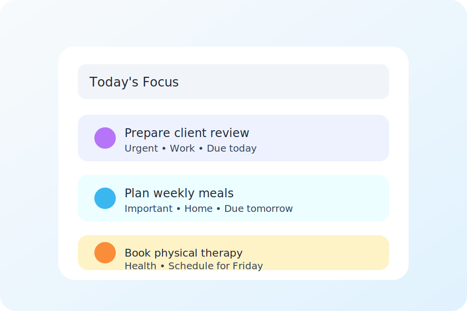

# Friday



Friday is a low-stress task manager that keeps you focused on the four most important things you can accomplish today. The app combines the Eisenhower Matrix with gentle daily limits, recurring task automation, and streak tracking so you can move your goals forward without burning out.

## Feature highlights

- **Today view:** Surfaces up to four tasks per day with a progress circle, daily streak indicator, and celebration state when everything is complete. Completed items remain visible alongside in-progress work so you can see momentum build.
- **Full schedule:** Switch to the schedule tab to review every upcoming task grouped by start date. Virtualized rendering keeps scrolling smooth even with large task lists.
- **Rich task creation:** Capture tasks with category, importance, urgency, estimated hours, due dates, and optional recurrence rules. Inputs normalize dates automatically so they work seamlessly across time zones.
- **Category + hour limits:** Configure weekday/weekend limits per category along with overall daily hour caps to maintain balance across work, home, health, and more.
- **Recurring automation:** Recurring tasks carry a shared series ID, generate future instances automatically, and respect category limits when they land on today.
- **Guided onboarding:** First-time users move through an onboarding flow that explains prioritization, captures an initial task, and stores completion status in Firestore/local storage.
- **Google sign-in:** Authentication uses Firebase Google Sign-In and persists user data (tasks, preferences, streaks) to Firestore with offline-friendly local caching and retry queues.
- **Developer utilities:** Signed-in users can toggle a debug drawer to reset data, view task allocation for today/tomorrow, and enable "test mode" to revisit onboarding.

## Architecture at a glance

- **Stack:** React 19 + TypeScript + Vite, styled with Tailwind CSS and iconography from lucide-react.
- **State management:** Custom context providers (`AppContext`, `AuthContext`) coordinate tasks, preferences, onboarding, streaks, and auth status.
- **Data layer:** Firebase Authentication + Cloud Firestore with localStorage fallback, offline persistence, and batched writes.
- **Scheduling logic:** `taskPrioritization` utilities score tasks via the Eisenhower Matrix, enforce category/hour limits, and assign start dates across a configurable lookahead window.
- **Testing:** Jest with React Testing Library for component and utility coverage.

## Getting started

### Prerequisites

- Node.js 18+ (aligned with the Vite + Jest toolchain)
- npm (bundled with Node) or pnpm/yarn
- A Firebase project with Google Authentication and Cloud Firestore enabled

### Installation

1. Clone the repository and install dependencies:

   ```bash
   git clone https://github.com/dgaraventa5/friday.git
   cd friday
   npm install
   ```

2. Copy the example environment file and fill in your Firebase/analytics configuration:

   ```bash
   cp .env.example .env.local
   ```

   | Variable | Purpose |
   | --- | --- |
   | `VITE_FIREBASE_*` | Firebase web app credentials (Auth + Firestore) |
   | `VITE_GA_MEASUREMENT_ID` | Optional Google Analytics measurement ID |
   | `VITE_APP_ENV` | Environment label (`development`, `staging`, `production`) |
   | `VITE_ONBOARDING_V1` | Feature flag for the current onboarding flow |

3. Start the development server:

   ```bash
   npm run dev
   ```

4. Open the app at [http://localhost:5173](http://localhost:5173). Sign in with Google to sync data to your Firebase project. Use `/onboarding` if you need to replay the guided tour.

### Production build & preview

```bash
npm run build
npm run preview
```

Deploy the generated `dist/` folder to Firebase Hosting (see `firebase.json`) or your hosting provider of choice.

## Available scripts

| Command | Description |
| --- | --- |
| `npm run dev` | Launches Vite in development mode with hot module reloading |
| `npm run build` | Produces an optimized production bundle |
| `npm run preview` | Serves the production build locally |
| `npm run lint` | Runs ESLint across the codebase |
| `npm run lint:fix` | Lints and attempts to automatically fix issues |
| `npm run test` | Executes the Jest test suite |
| `npm run format` | Applies Prettier formatting to supported files |

## Project structure

```
src/
  components/       Reusable UI building blocks (task list, inputs, modals, etc.)
  context/          React context providers for auth and global app state
  lib/              Firestore collection refs and helper bindings
  routes/           Top-level routed experiences (e.g., onboarding)
  types/            Shared TypeScript interfaces for tasks, users, streaks
  utils/            Task scoring, Firestore accessors, date helpers, analytics
public/             Static assets served by Vite/Firebase Hosting
docs/               Product and UX specifications for future work
```

Additional documentation lives in [`docs/`](docs/), including UI guidelines, product requirements, onboarding flow notes, and delight/gamification explorations.

## Contributing

1. Fork the repository and create a feature branch: `git checkout -b feature/amazing-feature`
2. Make your changes and ensure quality checks pass:
   - `npm run lint`
   - `npm run test`
3. Commit with a descriptive message and open a Pull Request.
4. Please include screenshots or Loom demos for UI updates when possible.

## License

This project is licensed under the MIT License. See the [LICENSE](LICENSE) file for details.
